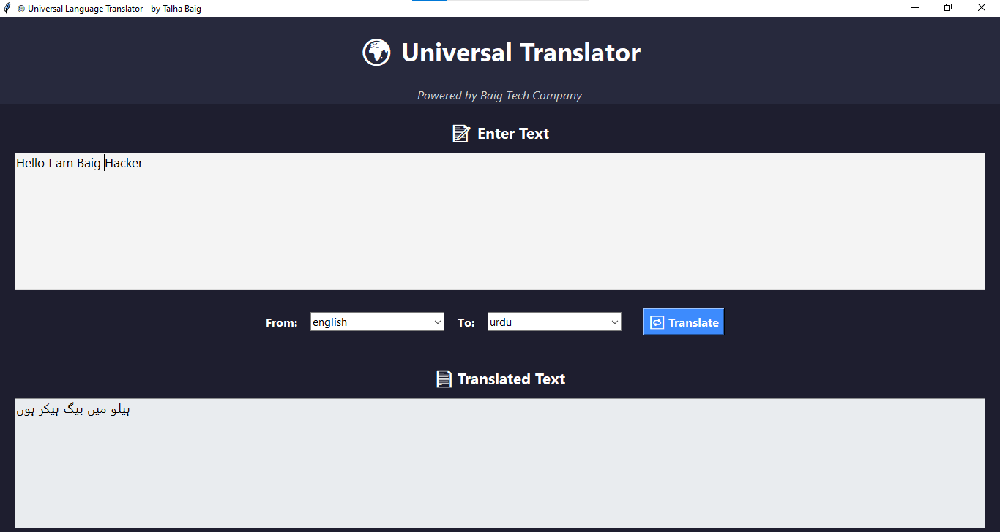

# 🌍 Universal Translator

A modern GUI-based Universal Translator app built using Python (Tkinter) that can translate text into multiple languages in real time. Ideal for students, professionals, and travelers.



---

## 🚀 Features

- 🌐 Supports translation between 100+ languages using Google Translate API  
- 🧠 Auto-detect input language  
- ✍️ Text-to-text translation  
- 💡 Simple, clean, and modern GUI with dark theme  
- 📦 Lightweight and fast  
- 🖥️ Cross-platform: Works on Windows and Linux  

---

## 🛠️ Tech Stack

- **Language:** Python  
- **GUI Framework:** Tkinter  
- **Translation API:** `googletrans==4.0.0-rc1`  

---

## 🧩 Requirements

Make sure Python is installed. Then install dependencies:

```bash
pip install googletrans==4.0.0-rc1
```

---

## 🧪 How to Run

1. Clone the repository:

```bash
git clone https://github.com/talhabaig007/universal-translator
cd universal-translator
```

2. Run the app:

```bash
python translator.py
```

---

## 📸 Screenshot

> Place your app screenshot in the repo and name it `screenshot.png`.


---

## 🤝 Contributing

Contributions are welcome! Please fork the repository and open a pull request with improvements, features, or bug fixes.

---

## 🧑‍💻 Developed By

**Talha Baig**  
Ethical Hacker | Cyber Security Expert | Python Developer  

🌐 Website: [talhabaig.exploreeverything.blog](https://talhabaig.exploreeverything.blog)  
📫 Email: baig78@hackermail.com  
🐙 GitHub: [@talhabaig007](https://github.com/talhabaig007)  
📘 Facebook: [Talha Baig](https://www.facebook.com/p/Talha-Baig-100063795712836/)  
📸 Instagram: [@talhabaig007](https://www.instagram.com/talhabaig007/)  
🐦 Twitter: [@talhabaig007](https://www.Twitter.com/talhabaig007/)  

---

## ⚖️ License

This project is licensed under the MIT License - see the [LICENSE](LICENSE) file for details.
